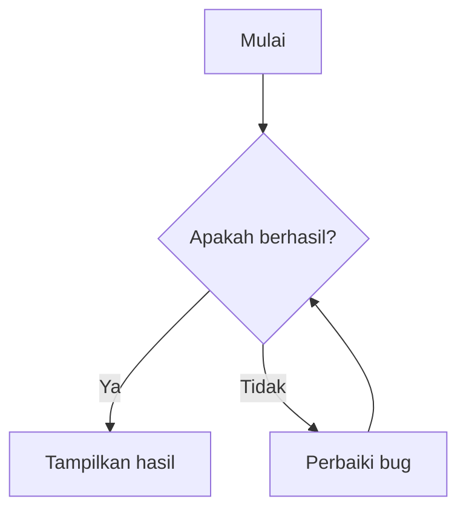
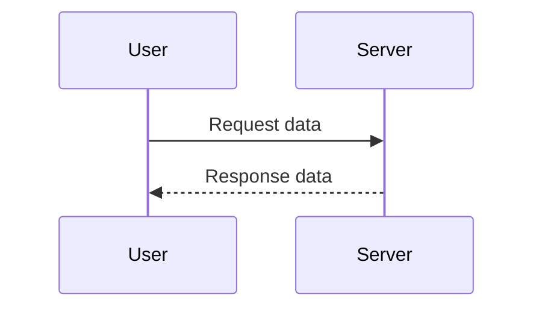
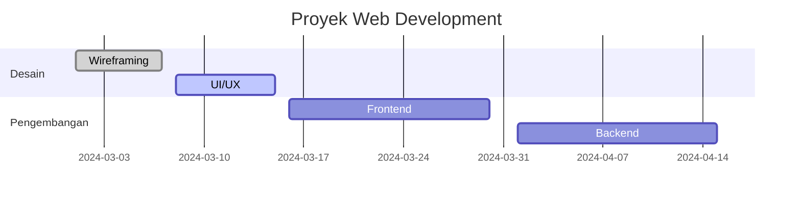

This content shows a preview of typography elements supported by the **My Notes** theme.  
**Happy Reading!**

## Headings
Here are examples of various **headings**:

# Heading 1  
## Heading 2  
### Heading 3  
#### Heading 4  
##### Heading 5  
###### Heading 6  

## Lists
### Unordered List
- List 1  
- List 2  
  - List 1 inside List 2  
  - List 2 inside List 2  
- List 3  

### Ordered List  
1. Ordered List 1  
2. Ordered List 2  
   1. Ordered List 1 inside Ordered List 2  
   2. Ordered List 2 inside Ordered List 2  
3. Ordered List 3  

### Definition List
First Term  
: This is the definition of the first term.  

Second Term  
: This is the definition of the second term.  
: This is another definition of the second term.  

## Task List
- [ ] Not done  
- [x] Done  

## Table

| Name  | Age | Hobby      | Profession |  
| ----- | ---- | --------- | ------- |  
| Ana   | 27   | Cooking   | Doctor  |  
| Budi  | 30   | Fishing   | Teacher    |  
| Arif  | 35   | Cycling   | Pilot   |  
| Agung | 21   | Reading   | Student |  

## Images  
### Left Aligned Image  
Anim nostrud cupidatat aliquip nulla fugiat fugiat ullamco exercitation dolore proident culpa laborum adipisicing anim. Officia nisi laborum laborum non reprehenderit consectetur qui culpa consequat. In amet nulla dolore nostrud proident duis laboris et officia sit. Tempor dolore voluptate in mollit deserunt non incididunt ex nostrud non officia nisi ut dolore.


Reprehenderit enim nisi magna cillum aute eiusmod aute laboris ut. Aliqua voluptate exercitation ea sint deserunt magna et. Aliqua quis esse id consequat consequat irure quis eu occaecat exercitation officia nisi do est. Sint minim duis minim adipisicing consequat duis.

### Right Aligned Image  
Consequat anim aliquip veniam consequat officia aliqua. Ullamco tempor deserunt cillum irure. Et est ut laborum ad laboris consectetur laborum consectetur esse minim ad. Est ut cillum fugiat occaecat adipisicing ipsum irure Lorem elit reprehenderit sit anim anim incididunt. Magna sunt velit in laboris ad proident aliqua magna fugiat irure aliqua consectetur. Esse anim sit ad pariatur commodo occaecat est quis.


Duis eiusmod amet est aliquip cillum labore consectetur deserunt. Labore aliqua cillum mollit cupidatat ullamco. Mollit dolore aliqua nostrud occaecat labore cillum et labore. Sint velit culpa et fugiat incididunt excepteur reprehenderit Lorem duis voluptate voluptate occaecat. Est quis labore irure in adipisicing nisi. Sunt et dolor in Lorem irure laborum deserunt. Incididunt aute id ad Lorem nostrud culpa elit ipsum id.

### Center Aligned Image  
Laborum ex duis voluptate tempor consequat veniam velit sunt elit. Elit et ipsum ullamco amet aliquip ea ullamco incididunt consequat do aliquip cillum. Anim ullamco non excepteur ullamco consectetur.


Reprehenderit veniam enim adipisicing duis anim aliquip sint laboris esse sint. Officia adipisicing esse aliquip cupidatat. Commodo nostrud laboris dolore ut incididunt fugiat est nostrud duis et non ullamco velit. Veniam duis nisi irure occaecat veniam adipisicing dolor commodo. Cupidatat culpa id nisi do dolore pariatur.

## Links  

[Go to Google](https://www.google.com)  

## Quotes and Alerts  

### Default Quote  

> This is a default quote.  

### Quote with Alerts  
> [!INFO] Information  
> This is an information alert.  

> [!TIP] Tips  
> This is a tip alert.  

> [!WARNING] Warning  
> This is a warning alert.  

> [!DANGER] Danger  
> This is a danger alert.  

> [!ERROR] Error  
> This is an error alert.

See complete Visit: [Alert Collection](callout.md)  

## Code  

### Python
```python
# Simple Python Program
def main():
    print("Hello, World!")
    
    # Addition operation
    a = 5
    b = 3
    hasil = a + b
    print(f"Hasil penjumlahan {a} + {b} = {hasil}")

if __name__ == "__main__":
    main()
```

### Golang
```go
package main

import "fmt"

func main() {
    fmt.Println("Hello, World!")

    // Addition operation
    a := 5
    b := 3
    hasil := a + b
    fmt.Printf("Hasil penjumlahan %d + %d = %d\n", a, b, hasil)
}
```

## Matematika

$$
\int_{0}^{\infty} \frac{x^2 e^{-x^2}}{1 + e^{x}} \, dx = \frac{\sqrt{\pi}}{2} \left( \text{Li}_2 \left( -e^{-1} 
\right) - \text{Li}_2 \left( -e^{-2} \right) \right)  
$$  

## Diagram
### Flowchart



### Sequence Diagram



### Gantt Chart



### GoAT ASCII  
```goat
    +---------+
    |  Root   |
    +----+----+
         |
    +----+----+
    |         |
  +----+   +----+
  | A  |   | B  |
  +----+   +----+
```

```goat
    +---------+
    |  Root   |
    +----+----+
         |
    +----+----+
    |         |
  +----+   +----+
  | A  |   | B  |
  +----+   +----+
```

## YouTube

  

## HTML in Markdown

<p style="color: red; font-weight: 700;">Red Text With 700 Weight</p>