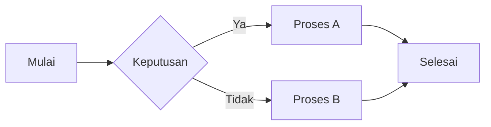

Konten ini memperlihatkan pratinjau elemen tipografi yang didukung oleh tema **My Notes**.  
**Selamat Membaca!**

## Judul (Heading)
Berikut adalah contoh berbagai **judul (Heading)**:

# Judul 1  
## Judul 2  
### Judul 3  
#### Judul 4  
##### Judul 5  
###### Judul 6  

## Daftar (List)
### Daftar tak berurutan
- Daftar 1  
- Daftar 2  
  - Daftar 1 di dalam Daftar 2  
  - Daftar 2 di dalam Daftar 2  
- Daftar 3  

### Daftar Berurutan  
1. Daftar Berurutan 1  
2. Daftar Berurutan 2  
   1. Daftar Berurutan 1 di dalam Daftar Berurutan 2  
   2. Daftar Berurutan 2 di dalam Daftar Berurutan 2  
3. Daftar Berurutan 3  

### Daftar Definisi
Istilah Pertama  
: Ini adalah definisi istilah pertama.  

Istilah Kedua  
: Ini adalah definisi dari istilah kedua.  
: Ini adalah definisi lain dari istilah kedua.  

## Daftar yang harus dilakukan
- [ ] Belum dilakukan  
- [x] Sudah dilakukan  

## Tabel

| Nama  | Umur | Hobi      | Profesi |  
| ----- | ---- | --------- | ------- |  
| Ana   | 27   | Memasak   | Dokter  |  
| Budi  | 30   | Memancing | Guru    |  
| Arif  | 35   | Bersepeda | Pilot   |  
| Agung | 21   | Membaca   | Pelajar |  

## Gambar  
### Bawaan markdown  

  

### Dengan Shortcodes Hugo  

#### Gambar rata kiri  

  
Gambar di kiri  


#### Gambar rata kanan  

  
Gambar di kanan.  


#### Gambar rata tengah  

  
Gambar di tengah  


#### Gambar lebar Penuh  

  
Gambar Lebar Penuh  


## Tautan  

[Menuju Google](https://www.google.com)  

## Kutipan dan Peringatan (Alert)  

### Kutipan Bawaan  

> Ini adalah kutipan bawaan.  

### Kutipan dengan Peringatan (Alert)  
> [!INFO]+ Informasi  
> Ini dengan peringatan (alert) Informasi.  

> [!TIP]+ Kiat-kiat  
> Ini dengan peringatan (alert) kiat (tip).  

> [!WARNING]+ Peringatan  
> Ini dengan peringatan (warning).  

> [!DANGER]+ Bahaya  
> Ini dengan peringatan (alert) Bahaya.  

> [!ERROR]+ Kesalahan  
> Ini dengan peringatan (alert) Kesalahan.  

Lihat lengkap Kunjungi: [Kumpulan Peringatan](kumpulan-peringatan.md)  

## Kode  

### Python  

```python  
print("Hello World")
```

### Javascript

```Javascript
console.log("Hello World")
```

## Matematika

$$
\int_{0}^{\infty} \frac{x^2 e^{-x^2}}{1 + e^{x}} \, dx = \frac{\sqrt{\pi}}{2} \left( \text{Li}_2 \left( -e^{-1} \right) - \text{Li}_2 \left( -e^{-2} \right) \right)  
$$  

## Diagram  

### Mermaid  



### GoAT ASCII  

```goat  
______     _____    _____   _______   _____   _______  
 /      \   /     \  /     \ /       \ /     \ /       \  
|        | |       ||       ||         ||     ||         |  
|  (o)(o)  |   \_/  ||   o   ||    |    || o   ||   |     |  
 \        /  \_____/  \_____/  \_______/ \_____/ \_______/  
  \______/
```  

## YouTube

  

## HTML di Markdown  

<p style="color: red; font-weight: 700;">Tulisan Merah Dengan Ketebalan 700</p>